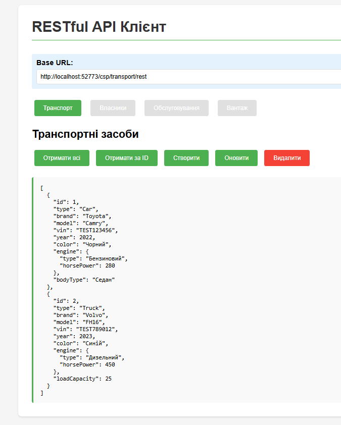
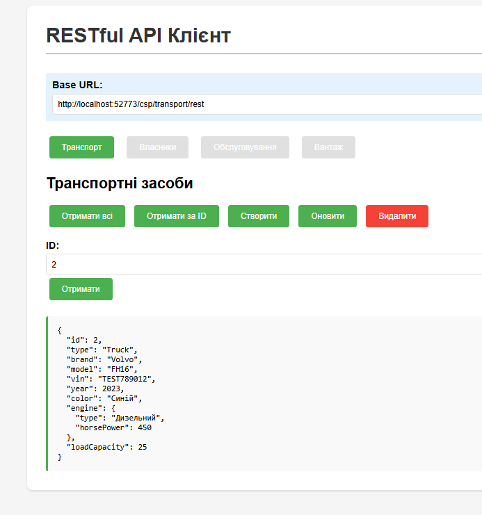
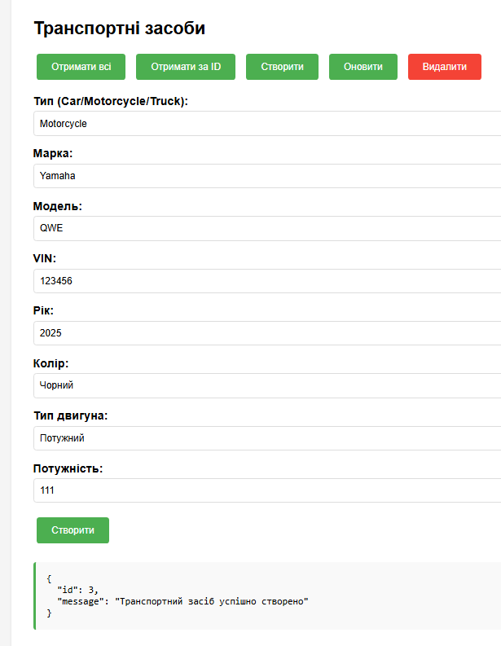
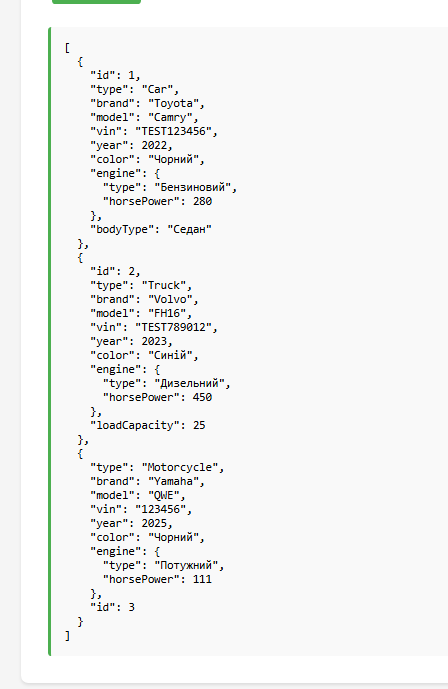
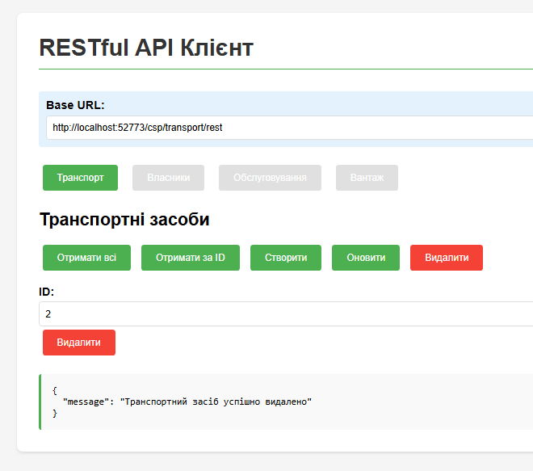
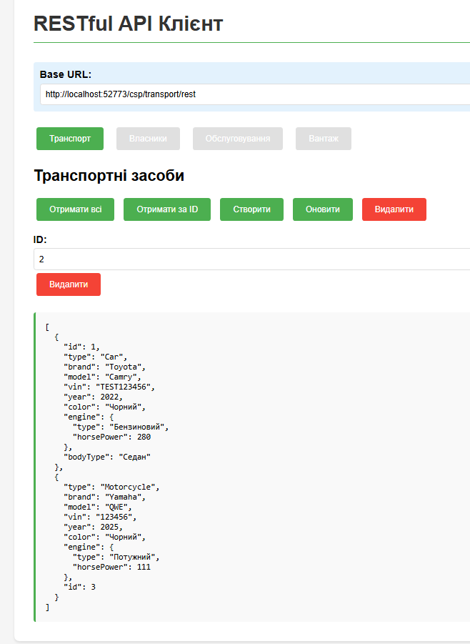
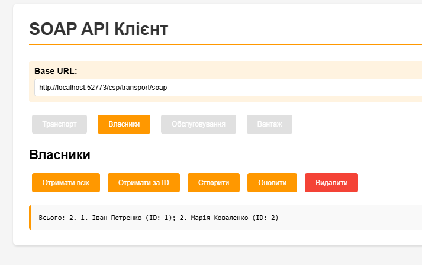
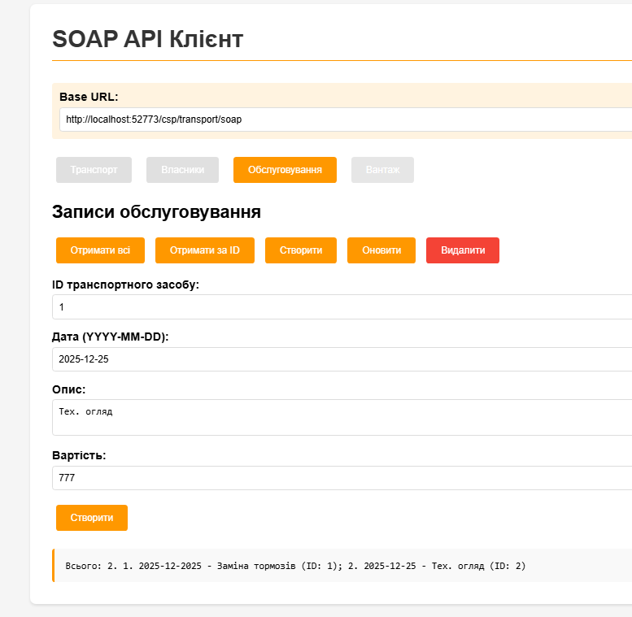
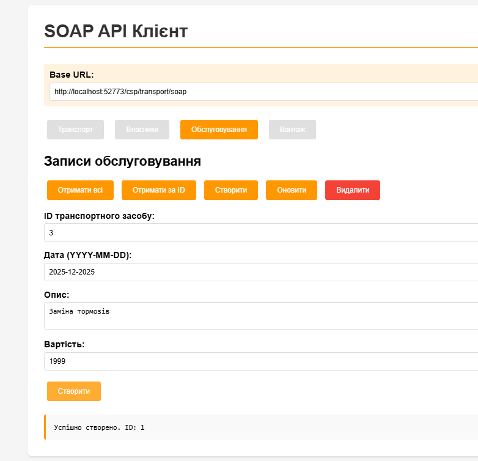

## ЛР №7: Створення Web-проєкту для звернення до об’єктів/таблиць/глобалів предметної області в IRIS з використанням CSP, REST і SOAP

### Завдання

1. Створити CSP веб-сторінки для роботи з об'єктами з комп'ютерного практикуму №4
2. Використати прямий доступ до БД для реалізації CRUD операцій (створення, відображення, редагування, видалення)
3. Створити RESTful та SOAP сервіси для виконання таких самих дій
4. Створити відповідні клієнти для взаємодії з сервісами

### Виконана робота

#### 1. CSP веб-сторінки

Створено 4 CSP сторінки для прямого доступу до бази даних:

- **`csp/vehicle.csp`** — управління транспортними засобами
- **`csp/owner.csp`** — управління власниками
- **`csp/servicerecord.csp`** — управління записами обслуговування
- **`csp/cargoitem.csp`** — управління вантажем

Кожна сторінка реалізує повний набір CRUD операцій:

- **Create** — створення нового об'єкта
- **Read** — перегляд всіх об'єктів та отримання за ID
- **Update** — оновлення існуючого об'єкта
- **Delete** — видалення об'єкта

#### 2. RESTful API сервіси

Створено 4 REST сервіси на базі класу `%CSP.REST`:

- **`Transport.REST.VehicleService`** — REST API для транспортних засобів
- **`Transport.REST.OwnerService`** — REST API для власників
- **`Transport.REST.ServiceRecordService`** — REST API для записів обслуговування
- **`Transport.REST.CargoItemService`** — REST API для вантажу

Кожен сервіс надає наступні ендпоінти:

- `GET /rest/{resource}` — отримати всі об'єкти
- `GET /rest/{resource}/{id}` — отримати об'єкт за ID
- `POST /rest/{resource}` — створити новий об'єкт
- `PUT /rest/{resource}/{id}` — оновити об'єкт
- `DELETE /rest/{resource}/{id}` — видалити об'єкт

#### 3. SOAP веб-сервіси

Створено 4 SOAP сервіси на базі класу `%SOAP.WebService`:

- **`Transport.SOAP.VehicleService`** — SOAP API для транспортних засобів
- **`Transport.SOAP.OwnerService`** — SOAP API для власників
- **`Transport.SOAP.ServiceRecordService`** — SOAP API для записів обслуговування
- **`Transport.SOAP.CargoItemService`** — SOAP API для вантажу

Кожен сервіс надає методи:

- `GetAll{Resource}()` — отримати всі об'єкти
- `Get{Resource}(id)` — отримати об'єкт за ID
- `Create{Resource}(params)` — створити новий об'єкт
- `Update{Resource}(id, params)` — оновити об'єкт
- `Delete{Resource}(id)` — видалити об'єкт

#### 4. Веб-клієнти

Створено HTML/JavaScript клієнти для тестування сервісів:

- **`clients/rest_client.html`** — клієнт для REST API
- **`clients/soap_client.html`** — клієнт для SOAP API

Клієнти надають зручний веб-інтерфейс з вкладками для різних типів об'єктів та формою для виконання CRUD операцій.

### Як запустити

#### Крок 1: Налаштування REST сервісів

1. Відкрийте InterSystems IRIS Management Portal
2. Перейдіть до **System Administration → Security → Applications → Web Applications**
3. Створіть нову веб-аплікацію:
   - **Name**: `/csp/transport/rest`
   - **Namespace**: `USER` (або ваш namespace)
   - **Enabled**: ✓
   - **Dispatch Class**: `Transport.REST.VehicleService`
   - **Authentication**: **Unauthenticated**

#### Крок 2: Налаштування SOAP сервісів

1. В Management Portal перейдіть до **System Administration → Security → Applications → Web Applications**
2. Створіть веб-аплікацію для SOAP:
   - **Name**: `/csp/transport/soap`
   - **Namespace**: `USER`
   - **Enabled**: ✓
   - **Type**: **SOAP**
   - **Service Class**: `Transport.SOAP.VehicleService`

#### Крок 3: Доступ до CSP сторінок

CSP сторінки доступні за адресами:

- `http://localhost:52773/csp/transport/vehicle.csp`
- `http://localhost:52773/csp/transport/owner.csp`
- `http://localhost:52773/csp/transport/servicerecord.csp`
- `http://localhost:52773/csp/transport/cargoitem.csp`

#### Крок 4: Використання веб-клієнтів

1. Відкрити файл `clients/rest_client.html` або `clients/soap_client.html` у браузері
2. В полі **Base URL** вказати адресу вашого сервера
3. Виконувати CRUD операції

### Як це працює

#### CSP сторінки

CSP сторінки використовують прямий доступ до бази даних через ObjectScript:

- Використовують класи `%ResultSet` для отримання даних
- Використовують методи класів (`%New()`, `%Save()`, `%DeleteId()`) для маніпуляції об'єктами
- Відображають дані у форматі HTML таблиць
- Надають форми для створення та редагування

#### REST API

REST сервіси працюють наступним чином:

1. Клієнт надсилає HTTP запит (GET, POST, PUT, DELETE) до ендпоінту
2. `%CSP.REST` маршрутизує запит до відповідного методу
3. Метод виконує операцію з базою даних
4. Результат повертається у форматі JSON
5. Клієнт отримує відповідь з даними або статусом операції

#### SOAP API

SOAP сервіси працюють наступним чином:

1. Клієнт формує SOAP запит (XML) з параметрами методу
2. `%SOAP.WebService` обробляє запит та викликає відповідний метод
3. Метод виконує операцію з базою даних
4. Результат повертається у форматі SOAP відповіді (XML)
5. Клієнт отримує результат у текстовому форматі

### Демонстрація виконання

| №   | Операція                                 | Опис                                                                                     | Скріншот                                                             |
| --- | ---------------------------------------- | ---------------------------------------------------------------------------------------- | -------------------------------------------------------------------- |
| 1   | REST: Отримати всі транспортні засоби    | Виконано GET запит до `/rest/vehicle` для отримання списку всіх транспортних засобів     |                    |
| 2   | REST: Отримати транспортний засіб за ID  | Виконано GET запит до `/rest/vehicle/1` для отримання конкретного транспортного засобу   |                |
| 3   | REST: Створити транспортний засіб        | Виконано POST запит до `/rest/vehicle` з даними нового транспортного засобу              |                     |
| 4   | REST: Перевірка після створення          | Отримано список транспортних засобів після створення нового запису                       |  |
| 5   | REST: Видалити транспортний засіб        | Виконано DELETE запит до `/rest/vehicle/{id}` для видалення запису                       |                     |
| 6   | REST: Перевірка після видалення          | Отримано список транспортних засобів після видалення запису                              |  |
| 7   | SOAP: Отримати всіх власників            | Виконано SOAP запит `GetAllOwners()` для отримання списку всіх власників                 |                         |
| 8   | SOAP: Отримати всі записи обслуговування | Виконано SOAP запит `GetAllServiceRecords()` для отримання списку записів обслуговування |           |
| 9   | SOAP: Створити запис обслуговування      | Виконано SOAP запит `CreateServiceRecord()` для створення нового запису обслуговування   |               |

### Висновки

В ході виконання лабораторної роботи було:

1. Створено 4 CSP веб-сторінки для прямого доступу до БД з повним функціоналом CRUD
2. Реалізовано 4 RESTful API сервіси з JSON форматом даних
3. Реалізовано 4 SOAP веб-сервіси з XML форматом даних
4. Створено веб-клієнти для тестування REST та SOAP сервісів
5. Протестовано всі CRUD операції через веб-інтерфейси та API
