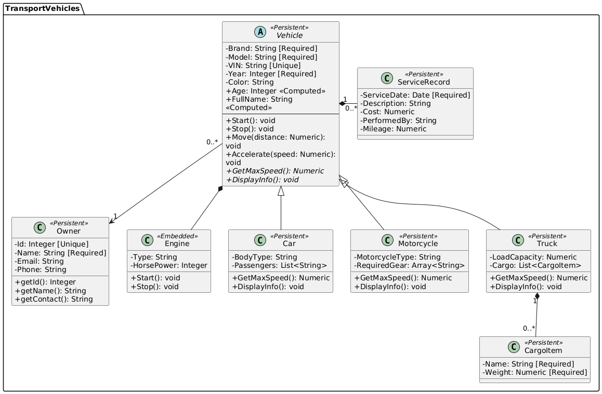

# Лабораторні роботи №3 та №4: Система транспортних засобів

## ЛР №3: Діаграма класів

### Завдання

Розробити діаграму класів з наступними елементами:

1. Успадкування від абстрактного класу
2. Атомарні властивості
3. Посилання на збережені об'єкти
4. Вбудовані об'єкти
5. Колекції-списки та колекції-масиви простих типів або об'єктів
6. Символьні або бінарні потоки
7. Відношення parent-children та one-many
8. Обчислювана властивість
9. Обов'язкова властивість
10. Унікальна властивість

### Діаграма класів



### Опис реалізованих елементів

#### 1. Успадкування від абстрактного класу ✓

- **Абстрактний клас `Vehicle`**: базовий клас з абстрактними методами `GetMaxSpeed()` та `DisplayInfo()`
- **Нащадки**:
  - `Car` (автомобіль)
  - `Motorcycle` (мотоцикл)
  - `Truck` (вантажівка)

#### 2. Атомарні властивості ✓

Приклади:

- `Vehicle.Brand: String`
- `Vehicle.Model: String`
- `Vehicle.VIN: String`
- `Vehicle.Year: Integer`
- `Vehicle.Color: String`
- `Owner.Name: String`
- `Engine.Type: String`
- `ServiceRecord.ServiceDate: Date`
- `Car.BodyType: String`
- `Truck.LoadCapacity: Numeric`
- `CargoItem.Name: String`

#### 3. Посилання на збережені об'єкти ✓

- `Vehicle.Owner` → `Owner` (composition, 1:many)
- `Vehicle.ServiceRecords` → `ServiceRecord` (association, 1:many)
- `Truck.Cargo` → `CargoItem` (aggregation, 1:many)

#### 4. Вбудовані об'єкти ✓

- `Vehicle.Engine` → `Engine` (embedded `%SerialObject`, 1:1, composition)
- `Engine` зберігається всередині `Vehicle`

#### 5. Колекції-списки та колекції-масиви ✓

- `Car.Passengers: List<String>` — список пасажирів
- `Motorcycle.RequiredGear: Array<String>` — масив спорядження

#### 6. Символьні або бінарні потоки ✓

- `%Storage.Persistent` створює потокові локації для всіх persistent класів
- Приклад: `StreamLocation` у `Vehicle`, `Owner`, `ServiceRecord`, `CargoItem`

#### 7. Parent-children та one-many ✓

- `Vehicle ← ServiceRecord` (parent-children)
- `Vehicle → ServiceRecord` (1:many)
- `Truck ← CargoItem` (parent-children)
- `Truck → CargoItem` (1:many)

#### 8. Обчислювані властивості ✓

- `Vehicle.Age: Integer` — вік транспорту
- `Vehicle.FullName: String` — марка + модель

#### 9. Обов'язкові властивості ✓

Приклади:

- `Vehicle.Brand: [Required]`
- `Vehicle.Model: [Required]`
- `Vehicle.Year: [Required]`
- `Owner.Name: [Required]`
- `Owner.Id: [Required]`
- `ServiceRecord.ServiceDate: [Required]`
- `CargoItem.Name: [Required]`
- `CargoItem.Weight: [Required]`

#### 10. Унікальні властивості ✓

- `Vehicle.VIN: [Unique]` — унікальний індекс
- `Owner.Id: [Unique]` — унікальний індекс

## ЛР №4: Реалізація в базі даних

### Завдання

Створити класи в базі даних на основі діаграми класів з ЛР3, створити принаймні по 2 об'єкти кожного класу, заповнити всі властивості (обов'язковість, унікальність) і зберегти в БД.

### Створені класи

#### 1. Vehicle.cls (абстрактний клас)

```objectscript:1:1:Transport/Vehicle.cls
Class Transport.Vehicle Extends (%Persistent, %Populate) [ Abstract ]
```

#### 2. Car.cls (нащадок Vehicle)

```objectscript:1:1:Transport/Car.cls
Class Transport.Car Extends Transport.Vehicle
```

#### 3. Motorcycle.cls (нащадок Vehicle)

```objectscript:1:1:Transport/Motorcycle.cls
Class Transport.Motorcycle Extends Transport.Vehicle
```

#### 4. Truck.cls (нащадок Vehicle)

```objectscript:1:1:Transport/Truck.cls
Class Transport.Truck Extends Transport.Vehicle
```

#### 5. Owner.cls (власник)

```objectscript:1:1:Transport/Owner.cls
Class Transport.Owner Extends %Persistent
```

#### 6. Engine.cls (вбудований об'єкт)

```objectscript:1:1:Transport/Engine.cls
Class Transport.Engine Extends %SerialObject
```

#### 7. ServiceRecord.cls (записи обслуговування)

```objectscript:1:1:Transport/ServiceRecord.cls
Class Transport.ServiceRecord Extends %Persistent
```

#### 8. CargoItem.cls (вантаж)

```objectscript:1:1:Transport/CargoItem.cls
Class Transport.CargoItem Extends %Persistent
```

### Створені об'єкти

#### Власники (3 об'єкти)

1. Іван Петренко (ID: 1)
2. Марія Коваленко (ID: 2)
3. Олег Сидоренко (ID: 3)

#### Автомобілі (2 об'єкти)

1. Toyota Camry, 2022, VIN: 1HGBH41JXMN109186
2. BMW X5, 2023, VIN: 5UXKR0C58L9R12345

#### Мотоцикли (2 об'єкти)

1. Harley-Davidson Street 750, 2021, VIN: 1HD1BZ4145K123456
2. Yamaha YZF-R6, 2022, VIN: JYARN17E08A123789

#### Вантажівки (2 об'єкти)

1. Volvo FH16, 2023, VIN: YV1CZ592481234567
2. MAN TGX, 2022, VIN: WMA06XZZ2E1234567

#### Вантаж (4 об'єкти)

- Для Volvo: будівельні матеріали (15.5 т), металеві конструкції (8.2 т)
- Для MAN: харчові продукти (12.3 т), побутова техніка (5.7 т)

#### Записи обслуговування (4 об'єкти)

- Для Toyota: 2 записи
- Для Harley-Davidson: 1 запис
- Для Volvo: 1 запис

### Заповнення властивостей

- Обов'язкові поля заповнені
- Унікальні поля перевірені
- Комплексні типи налаштовані: вбудовані об'єкти, колекції, відношення, обчислювані властивості

## Приклад роботи програми

```
%SYS>Do ##class(Transport.TransportDemo).Main()
=== ДЕМОНСТРАЦІЯ СИСТЕМИ ТРАНСПОРТНИХ ЗАСОБІВ ===


=== ДЕМОНСТРАЦІЯ РОБОТИ МЕТОДІВ ===


1. Car

╔══════════════════════════════════════
║         АВТОМОБІЛЬ
║ Марка: Toyota
║ Модель: Camry
║ VIN: 1HGBH41JXMN109186
║ Рік: 2022
║ Колір: Чорний
║ Тип кузова: Седан
║ Двигун: Бензиновий
║ Потужність: 280 к.с.
║ Макс. швидкість: 215 км/год
║ Пробіг: 3440 км
║ Пасажири: 35 осіб
╚════════════════════════════════════════

→ Запуск:
Двигун запущено. Потужність: 280 к.с.
1 готовий до руху.

→ Рух на 100 км:
1 проїхав 100 км. Загальний пробіг: 3540 км.

→ Прискорення до 120 км/год:
1 прискорено до 120 км/год.

→ Зупинка:
1 зупинено.
Двигун зупинено.
Пасажир Іван додано до автомобіля.

→ Пасажир доданий


2. Car

╔══════════════════════════════════════
║         АВТОМОБІЛЬ
║ Марка: BMW
║ Модель: X5
║ VIN: 5UXKR0C58L9R12345
║ Рік: 2023
║ Колір: Білий
║ Тип кузова: Кросовер
║ Двигун: Дизельний
║ Потужність: 340 к.с.
║ Макс. швидкість: 220 км/год
║ Пробіг: 2600 км
║ Пасажири: 29 осіб
╚════════════════════════════════════════

→ Запуск:
Двигун запущено. Потужність: 340 к.с.
1 готовий до руху.

→ Рух на 100 км:
1 проїхав 100 км. Загальний пробіг: 2700 км.

→ Прискорення до 120 км/год:
1 прискорено до 120 км/год.

→ Зупинка:
1 зупинено.
Двигун зупинено.
Пасажир Іван додано до автомобіля.

→ Пасажир доданий


3. Motorcycle

╔════════════════════════════════════════
║         МОТОЦИКЛ
║ Марка: Harley-Davidson
║ Модель: Street 750
║ VIN: 1HD1BZ4145K123456
║ Рік: 2021
║ Колір: Червоний
║ Тип: Круїзер
║ Двигун: Бензиновий
║ Потужність: 150 к.с.
║ Макс. швидкість: 265 км/год
║ Пробіг: 1800 км
║ Обов'язкове спорядження (4):
║   - Шолом
║   - Захисні рукавиці
║   - Захисний жилет
║   ... і ще 1 одиниць
╚════════════════════════════════════════

→ Запуск:
Двигун запущено. Потужність: 150 к.с.
1 готовий до руху.

→ Рух на 100 км:
1 проїхав 100 км. Загальний пробіг: 1900 км.

→ Прискорення до 120 км/год:
1 прискорено до 120 км/год.

→ Зупинка:
1 зупинено.
Двигун зупинено.

✓ Спорядження перевірено (є шолом)


4. Motorcycle

╔════════════════════════════════════════
║         МОТОЦИКЛ
║ Марка: Yamaha
║ Модель: YZF-R6
║ VIN: JYARN17E08A123789
║ Рік: 2022
║ Колір: Синій
║ Тип: Спортивний
║ Двигун: Бензиновий
║ Потужність: 118 к.с.
║ Макс. швидкість: 305 км/год
║ Пробіг: 1800 км
║ Обов'язкове спорядження (3):
║   - Спортивний шолом
║   - Шкіряні рукавиці
║   - Шкіряний комбінезон
╚════════════════════════════════════════

→ Запуск:
Двигун запущено. Потужність: 118 к.с.
1 готовий до руху.

→ Рух на 100 км:
1 проїхав 100 км. Загальний пробіг: 1900 км.

→ Прискорення до 120 км/год:
1 прискорено до 120 км/год.

→ Зупинка:
1 зупинено.
Двигун зупинено.


5. Truck

╔════════════════════════════════════════
║         ВАНТАЖІВКА
║ Марка: Volvo
║ Модель: FH16
║ VIN: YV1CZ592481234567
║ Рік: 2023
║ Колір: Синій
║ Вантажопідйомність: 25 т
║ Двигун: Дизельний
║ Потужність: 450 к.с.
║ Макс. швидкість: 120 км/год
║ Пробіг: 1800 км
║ Вантаж: 2 одиниць (23.7 т)
╚════════════════════════════════════════

→ Запуск:
Двигун запущено. Потужність: 450 к.с.
1 готовий до руху.

→ Рух на 100 км:
1 проїхав 100 км. Загальний пробіг: 1900 км.

→ Прискорення до 120 км/год:
1 прискорено до 120 км/год.

→ Зупинка:
1 зупинено.
Двигун зупинено.

→ Поточна вага вантажу: 23.7 т


6. Truck

╔════════════════════════════════════════
║         ВАНТАЖІВКА
║ Марка: MAN
║ Модель: TGX
║ VIN: WMA06XZZ2E1234567
║ Рік: 2022
║ Колір: Червоний
║ Вантажопідйомність: 20 т
║ Двигун: Дизельний
║ Потужність: 380 к.с.
║ Макс. швидкість: 120 км/год
║ Пробіг: 1800 км
║ Вантаж: 2 одиниць (18 т)
╚════════════════════════════════════════

→ Запуск:
Двигун запущено. Потужність: 380 к.с.
1 готовий до руху.

→ Рух на 100 км:
1 проїхав 100 км. Загальний пробіг: 1900 км.

→ Прискорення до 120 км/год:
1 прискорено до 120 км/год.

→ Зупинка:
1 зупинено.
Двигун зупинено.

→ Поточна вага вантажу: 18 т


=== Демонстрація завершена. Перевірено 6 засобів ===


=== ГОЛОВНЕ МЕНЮ ===
1. Переглянути всі транспортні засоби
2. Переглянути всіх власників
3. Знайти транспортний засіб за VIN
4. Переглянути історію обслуговування
5. Додати новий запис обслуговування
6. Статистика по типу транспорту
7. Продемонструвати роботу методів
0. Вихід

Оберіть опцію: 1

=== ВСІ ТРАНСПОРТНІ ЗАСОБИ ===

1. Car

╔══════════════════════════════════════
║         АВТОМОБІЛЬ
║ Марка: Toyota
║ Модель: Camry
║ VIN: 1HGBH41JXMN109186
║ Рік: 2022
║ Колір: Чорний
║ Тип кузова: Седан
║ Двигун: Бензиновий
║ Потужність: 280 к.с.
║ Макс. швидкість: 215 км/год
║ Пробіг: 3540 км
║ Пасажири: 36 осіб
╚════════════════════════════════════════

2. Car

╔══════════════════════════════════════
║         АВТОМОБІЛЬ
║ Марка: BMW
║ Модель: X5
║ VIN: 5UXKR0C58L9R12345
║ Рік: 2023
║ Колір: Білий
║ Тип кузова: Кросовер
║ Двигун: Дизельний
║ Потужність: 340 к.с.
║ Макс. швидкість: 220 км/год
║ Пробіг: 2700 км
║ Пасажири: 30 осіб
╚════════════════════════════════════════

3. Motorcycle

╔════════════════════════════════════════
║         МОТОЦИКЛ
║ Марка: Harley-Davidson
║ Модель: Street 750
║ VIN: 1HD1BZ4145K123456
║ Рік: 2021
║ Колір: Червоний
║ Тип: Круїзер
║ Двигун: Бензиновий
║ Потужність: 150 к.с.
║ Макс. швидкість: 265 км/год
║ Пробіг: 1900 км
║ Обов'язкове спорядження (4):
║   - Шолом
║   - Захисні рукавиці
║   - Захисний жилет
║   ... і ще 1 одиниць
╚════════════════════════════════════════

4. Motorcycle

╔════════════════════════════════════════
║         МОТОЦИКЛ
║ Марка: Yamaha
║ Модель: YZF-R6
║ VIN: JYARN17E08A123789
║ Рік: 2022
║ Колір: Синій
║ Тип: Спортивний
║ Двигун: Бензиновий
║ Потужність: 118 к.с.
║ Макс. швидкість: 305 км/год
║ Пробіг: 1900 км
║ Обов'язкове спорядження (3):
║   - Спортивний шолом
║   - Шкіряні рукавиці
║   - Шкіряний комбінезон
╚════════════════════════════════════════

5. Truck

╔════════════════════════════════════════
║         ВАНТАЖІВКА
║ Марка: Volvo
║ Модель: FH16
║ VIN: YV1CZ592481234567
║ Рік: 2023
║ Колір: Синій
║ Вантажопідйомність: 25 т
║ Двигун: Дизельний
║ Потужність: 450 к.с.
║ Макс. швидкість: 120 км/год
║ Пробіг: 1900 км
║ Вантаж: 2 одиниць (23.7 т)
╚════════════════════════════════════════

6. Truck

╔════════════════════════════════════════
║         ВАНТАЖІВКА
║ Марка: MAN
║ Модель: TGX
║ VIN: WMA06XZZ2E1234567
║ Рік: 2022
║ Колір: Червоний
║ Вантажопідйомність: 20 т
║ Двигун: Дизельний
║ Потужність: 380 к.с.
║ Макс. швидкість: 120 км/год
║ Пробіг: 1900 км
║ Вантаж: 2 одиниць (18 т)
╚════════════════════════════════════════


Всього: 6 транспортних засобів


=== ГОЛОВНЕ МЕНЮ ===
1. Переглянути всі транспортні засоби
2. Переглянути всіх власників
3. Знайти транспортний засіб за VIN
4. Переглянути історію обслуговування
5. Додати новий запис обслуговування
6. Статистика по типу транспорту
7. Продемонструвати роботу методів
0. Вихід

Оберіть опцію: 2

=== ВСІ ВЛАСНИКИ ===

1. Іван Петренко
   ID: 1
   Email: ivan.petrenko@email.com
   Телефон: +380501234567
   Контакт: ivan.petrenko@email.com, +380501234567

2. Марія Коваленко
   ID: 2
   Email: maria.kovalenko@email.com
   Телефон: +380507654321
   Контакт: maria.kovalenko@email.com, +380507654321

3. Олег Сидоренко
   ID: 3
   Email: oleg.sydorenko@email.com
   Телефон: +380509876543
   Контакт: oleg.sydorenko@email.com, +380509876543


Всього: 3 власників


=== ГОЛОВНЕ МЕНЮ ===
1. Переглянути всі транспортні засоби
2. Переглянути всіх власників
3. Знайти транспортний засіб за VIN
4. Переглянути історію обслуговування
5. Додати новий запис обслуговування
6. Статистика по типу транспорту
7. Продемонструвати роботу методів
0. Вихід

Оберіть опцію: 3

=== ПОШУК ТРАНСПОРТНОГО ЗАСОБУ ===
Введіть VIN: WMA06XZZ2E1234567

✓ ЗНАЙДЕНО: ВАНТАЖІВКА

╔════════════════════════════════════════
║         ВАНТАЖІВКА
║ Марка: MAN
║ Модель: TGX
║ VIN: WMA06XZZ2E1234567
║ Рік: 2022
║ Колір: Червоний
║ Вантажопідйомність: 20 т
║ Двигун: Дизельний
║ Потужність: 380 к.с.
║ Макс. швидкість: 120 км/год
║ Пробіг: 1900 км
║ Вантаж: 2 одиниць (18 т)
╚════════════════════════════════════════


=== ГОЛОВНЕ МЕНЮ ===
1. Переглянути всі транспортні засоби
2. Переглянути всіх власників
3. Знайти транспортний засіб за VIN
4. Переглянути історію обслуговування
5. Додати новий запис обслуговування
6. Статистика по типу транспорту
7. Продемонструвати роботу методів
0. Вихід

Оберіть опцію: 5

=== ДОДАВАННЯ ЗАПИСУ ОБСЛУГОВУВАННЯ ===
Введіть ID транспортного засобу: 1Опис робіт: Заміна фільтраВартість: 111Виконано: Іван

✓ Запис обслуговування успішно додано!


=== ГОЛОВНЕ МЕНЮ ===
1. Переглянути всі транспортні засоби
2. Переглянути всіх власників
3. Знайти транспортний засіб за VIN
4. Переглянути історію обслуговування
5. Додати новий запис обслуговування
6. Статистика по типу транспорту
7. Продемонструвати роботу методів
0. Вихід

Оберіть опцію: 4

=== ІСТОРІЯ ОБСЛУГОВУВАННЯ ===
Введіть ID транспортного засобу: 1

Транспорт: Toyota Camry (VIN: 1HGBH41JXMN109186)

--- Записи обслуговування ---

1. Дата: 31/10/2025
   Опис: йцу
   Вартість: 11 грн
   Виконано: 1
   Пробіг: 3340 км

2. Дата: 31/10/2025
   Опис: Заміна фільтра
   Вартість: 111 грн
   Виконано: Іван
   Пробіг: 3540 км

3. Дата: 21/10/2025
   Опис: Заміна гальмівних колодок
   Вартість: 3200 грн
   Виконано: Сервісний центр Toyota
   Пробіг: 18500 км

4. Дата: 01/10/2025
   Опис: Технічне обслуговування: заміна масла, фільтрів, перевірка гальм
   Вартість: 2500 грн
   Виконано: Сервісний центр Toyota
   Пробіг: 15000 км


Всього: 4 записів


=== ГОЛОВНЕ МЕНЮ ===
1. Переглянути всі транспортні засоби
2. Переглянути всіх власників
3. Знайти транспортний засіб за VIN
4. Переглянути історію обслуговування
5. Додати новий запис обслуговування
6. Статистика по типу транспорту
7. Продемонструвати роботу методів
0. Вихід

Оберіть опцію: 6

=== СТАТИСТИКА ПО ТИПУ ТРАНСПОРТУ ===

Автомобілі: 2
Мотоцикли: 2
Вантажівки: 2


Всього транспортних засобів: 6


=== ГОЛОВНЕ МЕНЮ ===
1. Переглянути всі транспортні засоби
2. Переглянути всіх власників
3. Знайти транспортний засіб за VIN
4. Переглянути історію обслуговування
5. Додати новий запис обслуговування
6. Статистика по типу транспорту
7. Продемонструвати роботу методів
0. Вихід

Оберіть опцію: 7
=== ДЕМОНСТРАЦІЯ РОБОТИ МЕТОДІВ ===


1. Car

╔══════════════════════════════════════
║         АВТОМОБІЛЬ
║ Марка: Toyota
║ Модель: Camry
║ VIN: 1HGBH41JXMN109186
║ Рік: 2022
║ Колір: Чорний
║ Тип кузова: Седан
║ Двигун: Бензиновий
║ Потужність: 280 к.с.
║ Макс. швидкість: 215 км/год
║ Пробіг: 3540 км
║ Пасажири: 36 осіб
╚════════════════════════════════════════

→ Запуск:
Двигун запущено. Потужність: 280 к.с.
1 готовий до руху.

→ Рух на 100 км:
1 проїхав 100 км. Загальний пробіг: 3640 км.

→ Прискорення до 120 км/год:
1 прискорено до 120 км/год.

→ Зупинка:
1 зупинено.
Двигун зупинено.
Пасажир Іван додано до автомобіля.

→ Пасажир доданий


2. Car

╔══════════════════════════════════════
║         АВТОМОБІЛЬ
║ Марка: BMW
║ Модель: X5
║ VIN: 5UXKR0C58L9R12345
║ Рік: 2023
║ Колір: Білий
║ Тип кузова: Кросовер
║ Двигун: Дизельний
║ Потужність: 340 к.с.
║ Макс. швидкість: 220 км/год
║ Пробіг: 2700 км
║ Пасажири: 30 осіб
╚════════════════════════════════════════

→ Запуск:
Двигун запущено. Потужність: 340 к.с.
1 готовий до руху.

→ Рух на 100 км:
1 проїхав 100 км. Загальний пробіг: 2800 км.

→ Прискорення до 120 км/год:
1 прискорено до 120 км/год.

→ Зупинка:
1 зупинено.
Двигун зупинено.
Пасажир Іван додано до автомобіля.

→ Пасажир доданий


3. Motorcycle

╔════════════════════════════════════════
║         МОТОЦИКЛ
║ Марка: Harley-Davidson
║ Модель: Street 750
║ VIN: 1HD1BZ4145K123456
║ Рік: 2021
║ Колір: Червоний
║ Тип: Круїзер
║ Двигун: Бензиновий
║ Потужність: 150 к.с.
║ Макс. швидкість: 265 км/год
║ Пробіг: 1900 км
║ Обов'язкове спорядження (4):
║   - Шолом
║   - Захисні рукавиці
║   - Захисний жилет
║   ... і ще 1 одиниць
╚════════════════════════════════════════

→ Запуск:
Двигун запущено. Потужність: 150 к.с.
1 готовий до руху.

→ Рух на 100 км:
1 проїхав 100 км. Загальний пробіг: 2000 км.

→ Прискорення до 120 км/год:
1 прискорено до 120 км/год.

→ Зупинка:
1 зупинено.
Двигун зупинено.

✓ Спорядження перевірено (є шолом)


4. Motorcycle

╔════════════════════════════════════════
║         МОТОЦИКЛ
║ Марка: Yamaha
║ Модель: YZF-R6
║ VIN: JYARN17E08A123789
║ Рік: 2022
║ Колір: Синій
║ Тип: Спортивний
║ Двигун: Бензиновий
║ Потужність: 118 к.с.
║ Макс. швидкість: 305 км/год
║ Пробіг: 1900 км
║ Обов'язкове спорядження (3):
║   - Спортивний шолом
║   - Шкіряні рукавиці
║   - Шкіряний комбінезон
╚════════════════════════════════════════

→ Запуск:
Двигун запущено. Потужність: 118 к.с.
1 готовий до руху.

→ Рух на 100 км:
1 проїхав 100 км. Загальний пробіг: 2000 км.

→ Прискорення до 120 км/год:
1 прискорено до 120 км/год.

→ Зупинка:
1 зупинено.
Двигун зупинено.


5. Truck

╔════════════════════════════════════════
║         ВАНТАЖІВКА
║ Марка: Volvo
║ Модель: FH16
║ VIN: YV1CZ592481234567
║ Рік: 2023
║ Колір: Синій
║ Вантажопідйомність: 25 т
║ Двигун: Дизельний
║ Потужність: 450 к.с.
║ Макс. швидкість: 120 км/год
║ Пробіг: 1900 км
║ Вантаж: 2 одиниць (23.7 т)
╚════════════════════════════════════════

→ Запуск:
Двигун запущено. Потужність: 450 к.с.
1 готовий до руху.

→ Рух на 100 км:
1 проїхав 100 км. Загальний пробіг: 2000 км.

→ Прискорення до 120 км/год:
1 прискорено до 120 км/год.

→ Зупинка:
1 зупинено.
Двигун зупинено.

→ Поточна вага вантажу: 23.7 т


6. Truck

╔════════════════════════════════════════
║         ВАНТАЖІВКА
║ Марка: MAN
║ Модель: TGX
║ VIN: WMA06XZZ2E1234567
║ Рік: 2022
║ Колір: Червоний
║ Вантажопідйомність: 20 т
║ Двигун: Дизельний
║ Потужність: 380 к.с.
║ Макс. швидкість: 120 км/год
║ Пробіг: 1900 км
║ Вантаж: 2 одиниць (18 т)
╚════════════════════════════════════════

→ Запуск:
Двигун запущено. Потужність: 380 к.с.
1 готовий до руху.

→ Рух на 100 км:
1 проїхав 100 км. Загальний пробіг: 2000 км.

→ Прискорення до 120 км/год:
1 прискорено до 120 км/год.

→ Зупинка:
1 зупинено.
Двигун зупинено.

→ Поточна вага вантажу: 18 т


=== Демонстрація завершена. Перевірено 6 засобів ===
```
