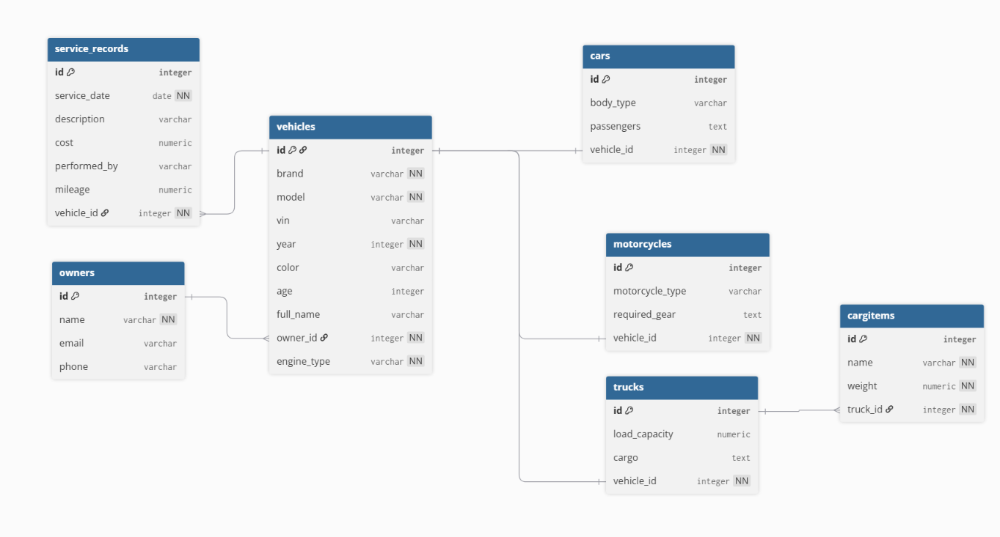
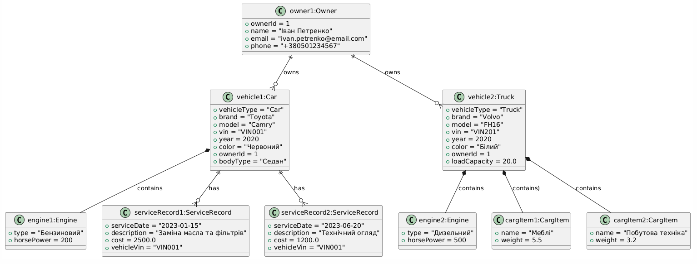
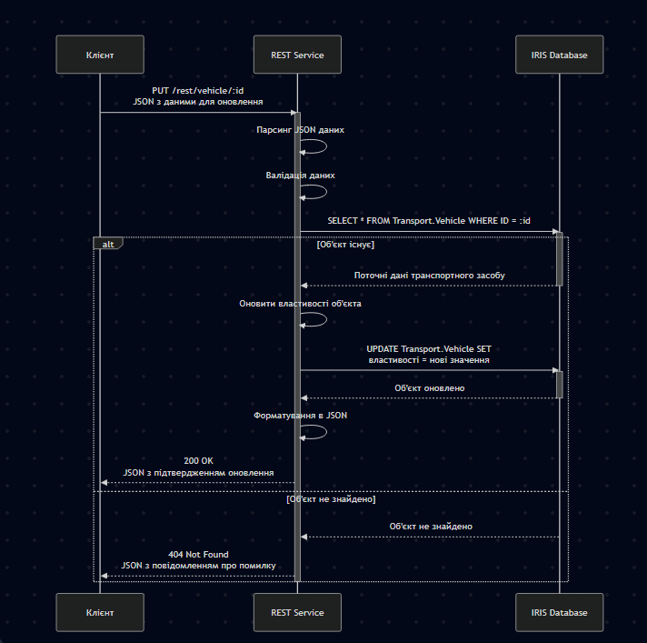
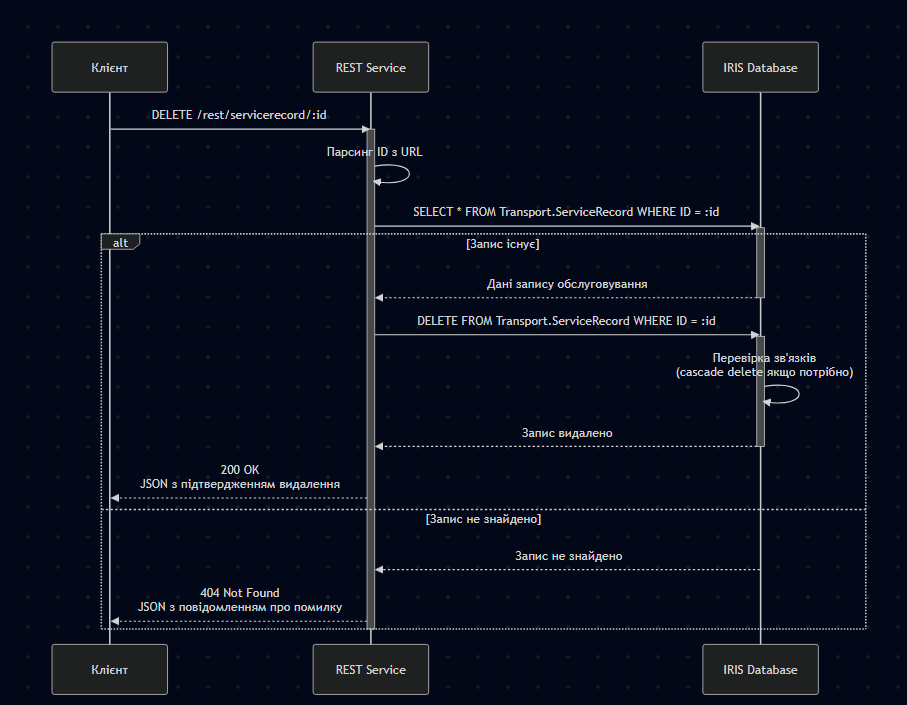
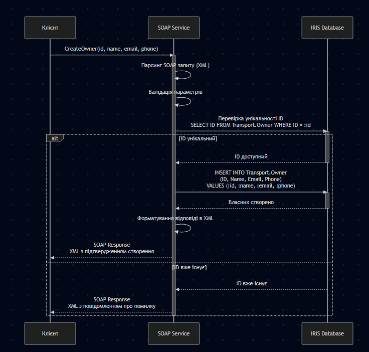
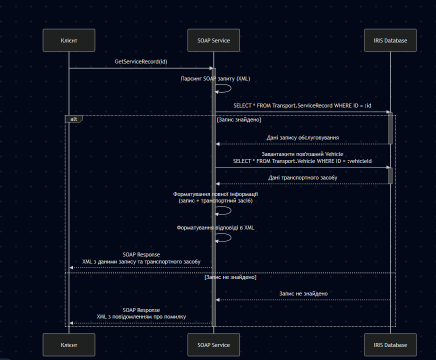

## 1. Схема реляційної БД.

## 2. Діаграма класів.

## 3. Діаграма об’єктів.

## 4. Діаграма послідовності.

### REST: Оновити транспортний засіб

### REST: Видалити запис обслуговування

### SOAP: Створити нового власника

### SOAP: Отримати запис обслуговування за ID

